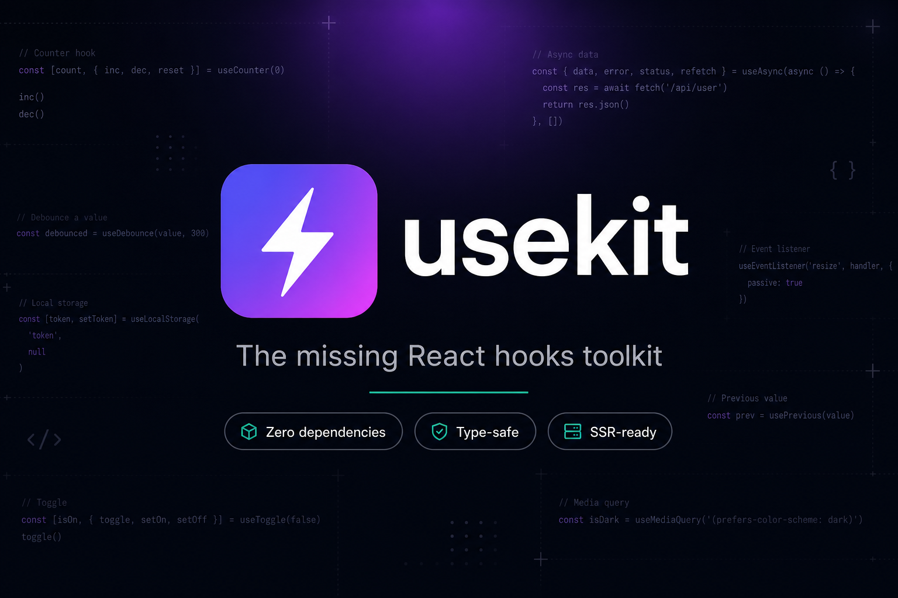

<div align="center">



# ⚡ usekit

**你一直缺的 React Hooks 工具库。**

32 个面向真实业务、类型完备、SSR 安全的 React Hooks —— **零依赖**，体积极小。

[](https://www.npmjs.com/package/usekit)
[](https://bundlephobia.com/package/usekit)
[](https://github.com/smallcaomei/usekit/actions)
[](#)
[](./LICENSE)
[](./CONTRIBUTING.md)

**[🚀 在线演示](https://smallcaomei.github.io/usekit/)** · [English](./README.md) · 简体中文

</div>

---

## 为什么选择 usekit？

- 🪶 **零运行时依赖** —— 除了 React（`>=16.8`）什么都不需要。
- 🌳 **完全可 Tree-shaking** —— `"sideEffects": false`，用多少打包多少。
- 🔒 **类型安全** —— 严格 TypeScript 编写，类型声明随包发布。
- 🖥️ **SSR 安全** —— 每个 Hook 都对 `window`/`document` 的缺失做了防护。
- 🧪 **经过测试** —— 由 Vitest + Testing Library 测试套件覆盖。
- 📦 **ESM + CJS 双格式** —— 从 Next.js 到 Vite 再到纯 Node 都能用。

## 安装

```bash
npm install usekit
# 或
pnpm add usekit
# 或
yarn add usekit
```

## 快速上手

```tsx
import { useDebounce, useLocalStorage, useToggle } from "usekit";

function SearchBox() {
  const [query, setQuery] = useLocalStorage("last-query", "");
  const debounced = useDebounce(query, 300);
  const [open, { toggle }] = useToggle(false);

  // `debounced` 会在用户停止输入 300ms 后才更新。
  return (
    <input value={query} onChange={(e) => setQuery(e.target.value)} />
  );
}
```

## Hooks 一览

> 👉 **[实时交互演示 →](https://smallcaomei.github.io/usekit/)** —— 每个演示都由真实的库驱动。

### 状态

| Hook | 说明 |
| --- | --- |
| [`useToggle`](./src/hooks/useToggle.ts) | 布尔状态，附带 `toggle` / `setTrue` / `setFalse`。 |
| [`useCounter`](./src/hooks/useCounter.ts) | 数值状态，支持 `inc` / `dec` / `reset` 与 min/max 钳制。 |
| [`useList`](./src/hooks/useList.ts) | 不可变数组操作：`push`、`removeAt`、`sort`、`filter`…… |
| [`usePrevious`](./src/hooks/usePrevious.ts) | 上一次渲染的值。 |
| [`useLatest`](./src/hooks/useLatest.ts) | 始终持有最新值的 ref。 |

### 存储

| Hook | 说明 |
| --- | --- |
| [`useLocalStorage`](./src/hooks/useStorage.ts) | 持久化状态，支持跨标签页同步。 |
| [`useSessionStorage`](./src/hooks/useStorage.ts) | 会话级持久化状态。 |
| [`useDarkMode`](./src/hooks/useDarkMode.ts) | 跟随系统并持久化的深色模式。 |

### 时序

| Hook | 说明 |
| --- | --- |
| [`useDebounce`](./src/hooks/useDebounce.ts) | 对值做防抖。 |
| [`useDebouncedCallback`](./src/hooks/useDebouncedCallback.ts) | 防抖函数，带 `cancel()` / `flush()`。 |
| [`useThrottle`](./src/hooks/useThrottle.ts) | 对值做节流。 |
| [`useInterval`](./src/hooks/useInterval.ts) | 声明式 `setInterval`（传 `null` 暂停）。 |
| [`useTimeout`](./src/hooks/useTimeout.ts) | 声明式 `setTimeout`。 |

### 生命周期

| Hook | 说明 |
| --- | --- |
| [`useMount`](./src/hooks/useMount.ts) | 挂载时执行一次回调。 |
| [`useUnmount`](./src/hooks/useUnmount.ts) | 卸载时执行回调。 |
| [`useUpdateEffect`](./src/hooks/useUpdateEffect.ts) | 跳过首次渲染的 `useEffect`。 |
| [`useIsomorphicLayoutEffect`](./src/hooks/useIsomorphicLayoutEffect.ts) | SSR 安全的 `useLayoutEffect`。 |

### 浏览器与视口

| Hook | 说明 |
| --- | --- |
| [`useMediaQuery`](./src/hooks/useMediaQuery.ts) | 响应式匹配 CSS 媒体查询。 |
| [`useWindowSize`](./src/hooks/useWindowSize.ts) | 追踪窗口内部尺寸。 |
| [`useElementSize`](./src/hooks/useElementSize.ts) | 用 `ResizeObserver` 测量元素。 |
| [`useIntersectionObserver`](./src/hooks/useIntersectionObserver.ts) | 观察元素可见性（懒加载、滚动揭示）。 |
| [`useCopyToClipboard`](./src/hooks/useCopyToClipboard.ts) | 复制文本，自带优雅降级。 |
| [`useNetworkState`](./src/hooks/useNetworkState.ts) | 在线/离线 + 连接质量。 |
| [`useGeolocation`](./src/hooks/useGeolocation.ts) | 追踪用户地理位置。 |
| [`useScrollLock`](./src/hooks/useScrollLock.ts) | 为弹窗/抽屉锁定页面滚动。 |
| [`useDocumentTitle`](./src/hooks/useDocumentTitle.ts) | 同步 `document.title`。 |

### 事件

| Hook | 说明 |
| --- | --- |
| [`useEventListener`](./src/hooks/useEventListener.ts) | 强类型声明式 `addEventListener`。 |
| [`useClickOutside`](./src/hooks/useClickOutside.ts) | 检测元素外部点击。 |
| [`useHover`](./src/hooks/useHover.ts) | 通过 ref 追踪悬停状态。 |
| [`useKeyPress`](./src/hooks/useKeyPress.ts) | 响应按键与组合键（如 `⌘K`）。 |
| [`useIdle`](./src/hooks/useIdle.ts) | 检测用户空闲。 |

### 数据

| Hook | 说明 |
| --- | --- |
| [`useFetch`](./src/hooks/useFetch.ts) | 轻量数据请求，含 loading/error 状态、取消与重取。 |

## 示例

<details>
<summary><b>用 <code>useKeyPress</code> 实现命令面板快捷键</b></summary>

```tsx
import { useKeyPress } from "usekit";

function App() {
  const [open, setOpen] = useState(false);
  useKeyPress("k", () => setOpen(true), {
    modifiers: { meta: true }, // ⌘K
    preventDefault: true,
  });
  return open ? <CommandPalette onClose={() => setOpen(false)} /> : null;
}
```

</details>

<details>
<summary><b>点击外部关闭下拉菜单</b></summary>

```tsx
import { useRef, useState } from "react";
import { useClickOutside } from "usekit";

function Dropdown() {
  const [open, setOpen] = useState(false);
  const ref = useRef<HTMLDivElement>(null);
  useClickOutside(ref, () => setOpen(false));
  return open ? <div ref={ref}>…菜单…</div> : null;
}
```

</details>

<details>
<summary><b>用 <code>useIntersectionObserver</code> 懒加载图片</b></summary>

```tsx
import { useIntersectionObserver } from "usekit";

function LazyImage({ src, alt }: { src: string; alt: string }) {
  const { ref, isIntersecting } = useIntersectionObserver({
    freezeOnceVisible: true,
  });
  return ;
}
```

</details>

## SSR 与 Next.js

所有 Hooks 都是服务端安全的。仅浏览器可用的 Hooks（`useWindowSize`、`useMediaQuery` 等）
会在服务端返回合理的默认值，并在客户端水合，因此不会出现引用错误或水合不一致。

## 本地开发

```bash
npm install          # 安装依赖
npm run build        # 用 tsup 构建库（ESM + CJS + d.ts）
npm test             # 运行 Vitest 测试
npm run typecheck    # 仅做类型检查
npm run demo         # 在 localhost:5173 启动交互演示
```

## 参与贡献

非常欢迎 PR！新增一个 Hook 很简单 —— 详见 **[CONTRIBUTING.md](./CONTRIBUTING.md)**。

## 许可证

[MIT](./LICENSE) © usekit contributors
